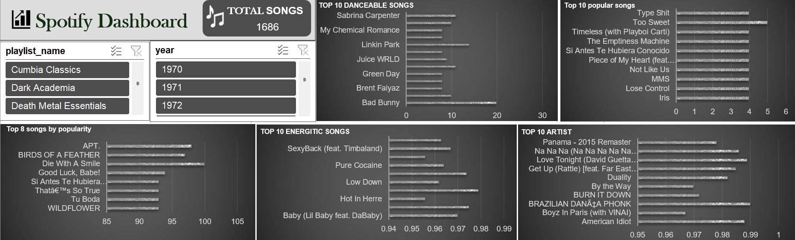

# spotify-music-analytics-dashboard
Spotify Music Analytics Dashboard built in Excel with data cleaning, interactive filters, KPIs, and visual analysis.
## Project Overview

This project analyzes Spotify music data using Microsoft Excel and presents the analysis through an interactive dashboard.

## Data Cleaning

The raw Spotify dataset was cleaned and prepared for analysis before creating the dashboard.

## Dashboard

## Tools Used

- Microsoft Excel
- Data Cleaning
- Pivot Tables
- Pivot Charts
- Slicers
- Data Visualization
